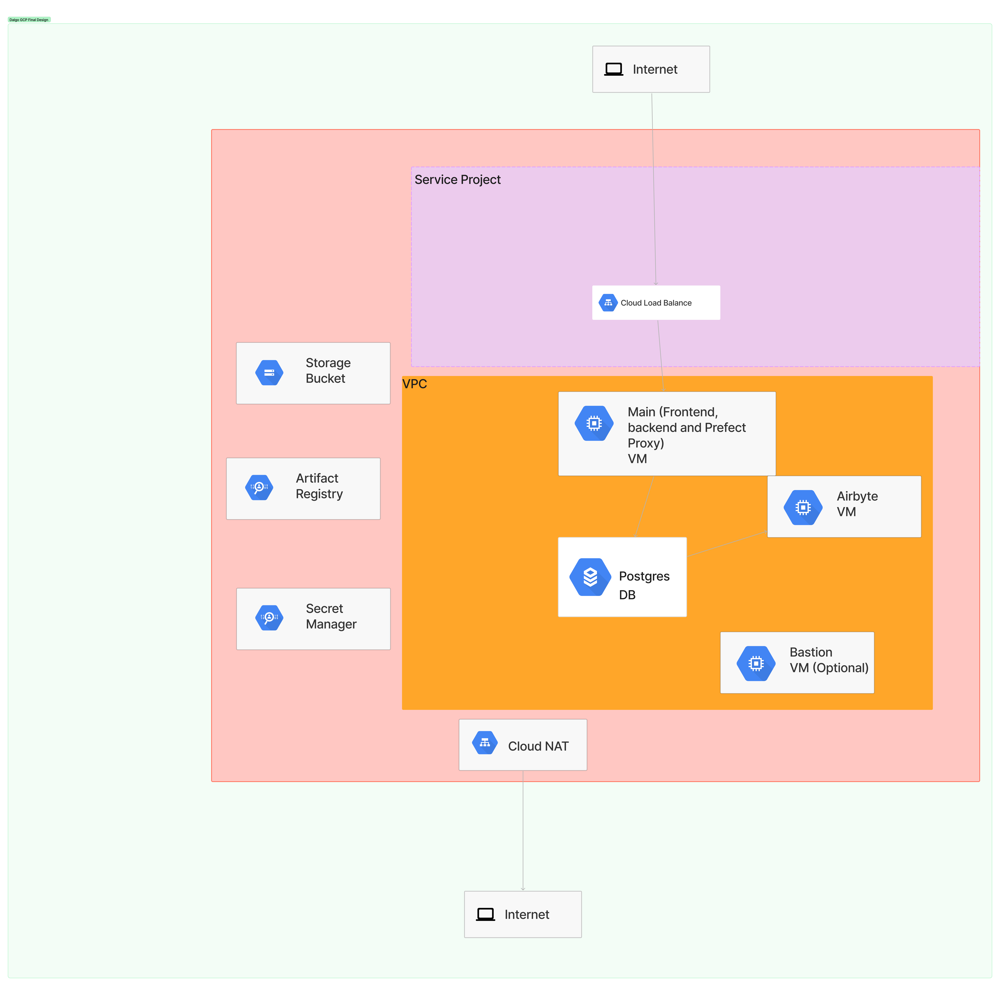

# Dalgo on GCP

Below are the steps to follow when creating the dalgo infrastructure on GCP

## Step 1: Create GCP project
First create a project on GCP. The name of the project will be added as a variable in `.tfvars`

## Step 2: Initialize the project on terminal

Run `gcloud init` to initialize the project. This will make sure that all resources created by terraform will the on that project.

Run `gcloud auth application-default login` to login

## Step 3: Create terraform state bucket

If it is the first time, you will need to create the bucket that will store the terraform state. If this is not the first time, skip this step.

`cd tf_backend`
`terraform init`
`terraform plan`

## Step 4: Create The Prod Infra
This code create this architecture on GCP

To create the whole prod infrastructure, follow the steps below:
* Ensure you are logged in  `gcloud auth application-default login`
* Move to the prod folder - `cd prod`
* Make changes to the variables file: `prod.auto.tfvars`
* If it is the first time, initialize - `terraform init`
* Confirm the changes that will be done - `terraform plan`
* Apply the changes - `terraform apply`
* Once the infrastructure is up, update the secrets with actual values manually
* Deploy dalgo and Airbyte